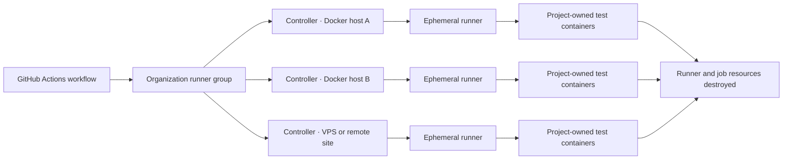
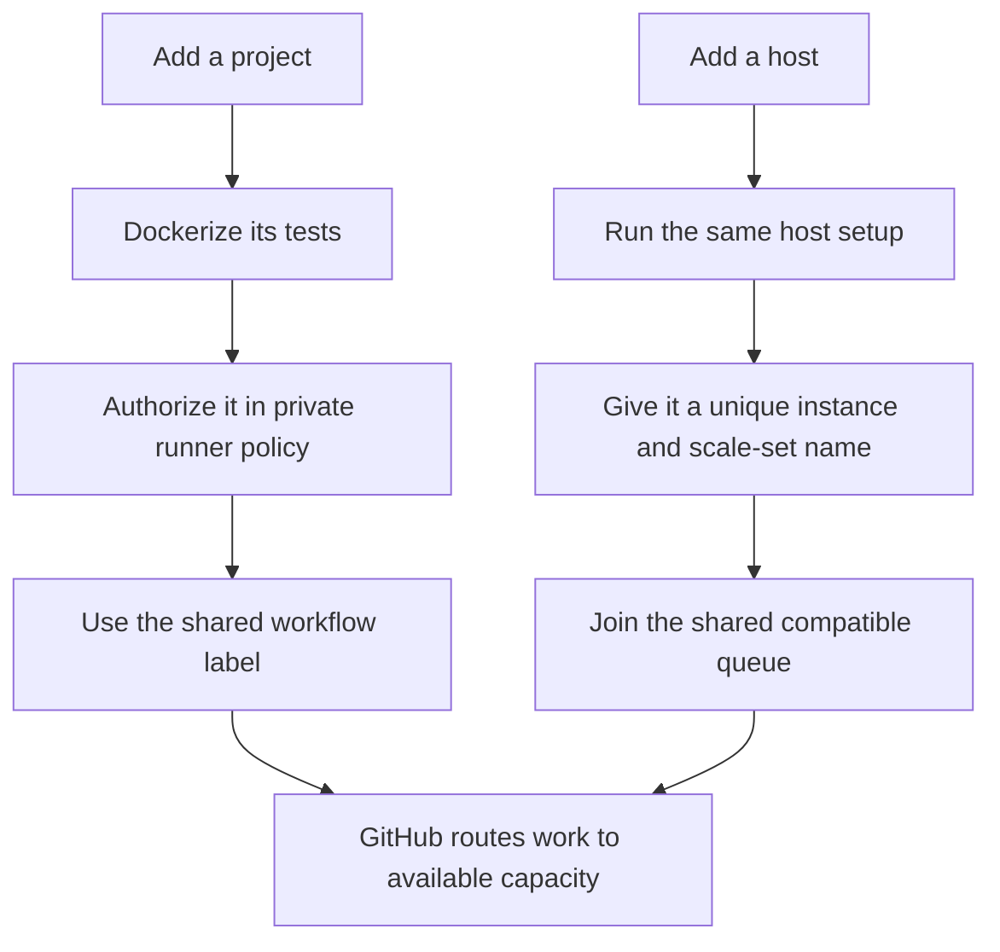

# ci-fleet

[](#project-status)
[](LICENSE)
[](#requirements)

**A portable, self-hosted software delivery fleet for ephemeral GitHub Actions runners and project-owned Docker test environments.**

Use one shared pool of disposable CI workers across multiple trusted private repositories, Docker hosts, virtual machines, bare-metal computers, home labs, remote sites, or VPS providers. Projects bring their own Dockerized build and test environment; fleet hosts stay generic.

> **Status:** Experimental. Ephemeral runner pilots and multi-job workloads have been proven, and the schema-v3 Git-authored controller installer is available for reviewed adoption testing. The project is not production-ready.

## What problem does this solve?

Self-hosted CI often grows one project at a time:

- every repository gets a different runner machine;
- language runtimes and dependencies accumulate on the host;
- idle machines cannot easily help other projects;
- persistent runners retain workspaces, containers, caches, and credentials;
- fixed ports and Docker names prevent parallel jobs;
- adding another computer means repeating undocumented setup;
- test, release, and production deployment permissions blur together.

ci-fleet replaces that pattern with generic Docker hosts and single-job runner containers. GitHub routes work from authorized repositories to any compatible host with available capacity. The selected project then starts its own pinned Docker test environment.

## What runs where?

A fleet host stays generic. Its operating system provides Linux, Docker, and the fleet controller. Application runtimes and services are still required, but each project supplies them through its own Docker images and Compose configuration.

| Layer | Examples |
| --- | --- |
| Fleet host | Linux, Docker Engine, fleet controller, monitoring and maintenance |
| Ephemeral runner | GitHub Actions agent, repository checkout, and Docker job orchestration |
| Project-owned containers | PHP, Composer, Node.js, Python, PostgreSQL, MySQL, application code, and tests |

When a job arrives:

1. the controller creates a fresh GitHub Actions runner container;
2. the runner checks out the selected repository;
3. the repository builds or starts its project-owned containers;
4. tests run inside the project-defined environment;
5. job-owned resources and the runner are destroyed;
6. the host returns to the shared idle pool.

One host can run one worker. A larger host can run several. Hosts in different locations can advertise the same capability without projects knowing which machine will accept the job.

## Is this for you?

ci-fleet is intended for people and organizations that:

- maintain multiple trusted private repositories or public projects with private delivery control;
- want self-hosted GitHub Actions runners without project-specific host images;
- already use Docker or want reproducible Dockerized CI;
- have spare servers, virtual machine capacity, workstations, remote-site computers, or VPS instances;
- want idle hardware shared across projects;
- need horizontal test sharding and short feedback times;
- want documented cleanup, automatic host security updates, health checks, and recovery;
- expect to add projects and hosts without rebuilding the whole fleet.

It is probably **not** the right starting point when:

- untrusted public pull requests must execute on the runners;
- you want fully managed CI with no infrastructure responsibility;
- containers sharing a Docker daemon must be treated as separate security boundaries;
- project tests cannot yet run reproducibly in containers;
- ordinary CI jobs require production or internal-network credentials.

## How it works



GitHub runner-group policy decides which repositories may schedule work. A shared routing label lets compatible repositories use any healthy host. Each controller owns a uniquely named scale set, so adding or removing one host does not require editing every project workflow.

### Three responsibility layers

| Layer | Owns | Must not contain |
| --- | --- | --- |
| Public fleet repository | Runner image, controller, lifecycle, setup, health checks, scoped cleanup, standards, examples | Real credentials, private host inventory, production configuration |
| Project repository | Test Dockerfile, services, fixtures, migrations, test plan, `scripts/ci/run.sh` | Fleet controller credentials or host-specific setup |
| Private installation configuration | Organization settings, repository authorization, logical controller state, capacity budgets, network policy, and required secret names | Secret values, host addresses, project runtime dependencies, or test logic |

A public application can use the same fleet indirectly. Its public repository keeps pull-request validation unprivileged, while a separate private delivery repository checks out an approved immutable commit and performs protected CI, release, or deployment work. The public repository itself never receives privileged runner-group access or fleet credentials. See [Public projects, private delivery, and private configuration](docs/PUBLIC-PRIVATE-CONFIGURATION.md).

## What makes it different?

### Generic hosts

A compatible host is enrolled once. Adding another project changes GitHub policy and that project's workflow—not every runner image or existing host.

### Ephemeral workers

Each runner accepts one job and is destroyed. This reduces stale workspace and process state, although Docker access still makes the job host-privileged.

### Project-owned environments

A PHP project can use PHP and MySQL containers while a Node project uses Node and PostgreSQL. The same runner host serves both without installing either runtime directly.

### Horizontal test sharding

Projects publish independent tasks and shards. The internal target is that ordinary CI jobs complete within five minutes, with no more than about four minutes of test payload per shard.

```bash
./scripts/ci/run.sh unit --shard 1/4
./scripts/ci/run.sh integration --shard 2/3
```

With enough independent work and available workers, 45 minutes of sequential tests can become roughly nine five-minute jobs instead of one long runner reservation.

### Scoped cleanup

Projects namespace resources by workflow run. Runners are destroyed after use. Host cleanup touches only expired, fleet-owned resources—never an unscoped `docker system prune`.

### Separated privilege

Read-only validation, repository-writing releases, staging, production deployment, and internal-network access belong in separate runner groups, credentials, and preferably separate hosts or security boundaries.

## Project status

| Capability | Status |
| --- | --- |
| Public architecture, standards, examples, and migration rules | Available |
| Docker runner and controller prototype | Available |
| First isolated controller host | Deployed |
| First manually dispatched private-repository pilot job | Proven |
| Schema-v3 worker-controller installer | Available for experimental install and adoption |
| MailThisForMe migration | Parallel task-matrix validation in progress |
| TF2 Recommendation Engine migration | Planned after pilot |
| Reusable tester and deployer components | Planned |
| Production-ready release | Not yet |

The current live milestone is deliberately narrow: one manually triggered, read-only job on one ephemeral worker without modifying or replacing existing project CI.

## Requirements

A fleet installation currently assumes:

- a Linux Docker host;
- Docker Engine and Docker Compose v2;
- a GitHub organization;
- a GitHub App with narrowly scoped self-hosted-runner permission;
- an organization runner group restricted to selected trusted private repositories;
- host-local or externally managed secrets;
- project tests that can run inside project-owned Docker containers.

Supported deployment shapes include virtual machines, dedicated physical machines, home-lab servers, remote buildings, and VPS hosts. Kubernetes is not required.

## Choose your path

| If you want to… | Start here |
| --- | --- |
| Understand the architecture and trust boundaries | [Architecture](docs/ARCHITECTURE.md) |
| Understand how runners are created and destroyed | [Runner controller design](docs/CONTROLLER-DESIGN.md) |
| Browse every guide, concept, standard, and example | [Documentation index](docs/README.md) |
| Evaluate the current prototype safely | [Live pilot runbook](docs/LIVE-PILOT.md) |
| Add another Docker host or location | [How to add a host](docs/ADDING-A-HOST.md) |
| Install, adopt, check, upgrade, or remove a controller | [Git-authored controller desired state](docs/DESIRED-STATE.md) |
| Add a trusted private repository | [How to add a project](docs/ADDING-A-PROJECT.md) |
| Convert existing GitHub Actions CI | [Migrating existing CI](docs/MIGRATING-EXISTING-CI.md) |
| Build a compatible project contract | [Project CI standard](docs/PROJECT-STANDARD.md) |
| Verify project compliance | [Compliance checklist](docs/COMPLIANCE-CHECKLIST.md) |
| Configure upgrades, cleanup, draining, and rebooting | [Host maintenance](docs/HOST-MAINTENANCE.md) |
| Understand secret storage and injection | [Secrets model](docs/SECRETS.md) |
| Use private fleet workers for a public project | [Public projects and private delivery](docs/PUBLIC-PRIVATE-CONFIGURATION.md) |
| See planned work | [Roadmap](docs/ROADMAP.md) |

## Project contract

A participating repository owns its test plan and exposes one stable entrypoint:

```text
project-repository/
├── Dockerfile.test
├── compose.ci.yaml
└── scripts/
    └── ci/
        ├── plan.json
        └── run.sh
```

Aggregate commands remain useful locally:

```bash
./scripts/ci/run.sh fast
./scripts/ci/run.sh full
```

The task plan expands into independent GitHub jobs and shards for fleet execution. Application validation must remain in project-owned containers; the generic runner image does not become a universal language-runtime image.

Read the mandatory [Project CI standard](docs/PROJECT-STANDARD.md), then use the [migration guide](docs/MIGRATING-EXISTING-CI.md) and [compliance checklist](docs/COMPLIANCE-CHECKLIST.md).

## Set-and-forget growth



The design goal is that future growth is routine:

- a new project does not require rebuilding existing hosts;
- a new host does not require changing existing projects;
- a remote location can disappear without corrupting another host's scale set;
- capacity can range from one runner to many;
- project runtimes remain independently versioned;
- updates and cleanup are observable and reversible.

## Security model

A self-hosted runner with Docker socket access is effectively host-root-equivalent. Multiple runner containers sharing one Docker daemon improve utilization, not security isolation.

Use this fleet only for explicitly trusted repositories and workflows. Keep deployment credentials out of the shared validation pool. Do not give this public repository access to a privileged private runner group. Never commit real environment files, GitHub App private keys, tokens, internal addresses, or host inventories.

Read [SECURITY.md](SECURITY.md) and the [secrets model](docs/SECRETS.md) before registration or deployment.

## Install or adopt a controller

After creating the GitHub App/runner group and placing the host-local identity file, run one command on the target machine with a reviewed private configuration commit:

```bash
sudo ./scripts/install-worker-controller.sh \
  --install \
  --config-repo example-org/example-fleet-config \
  --ref 1111111111111111111111111111111111111111 \
  --controller example-ci-01
```

Use `--adopt` for an existing manually installed controller. The same script provides `--check`, `--upgrade`, `--rollback`, and `--uninstall`. It validates schema-v3 desired state, renders only non-secret host configuration, installs the pinned engine revision, drains before replacement, records a rollback checkpoint, and installs health, scoped-cleanup, and drift timers.

The installer remains experimental and intentionally does not create GitHub credentials or broaden runner-group access. Phone-friendly GitHub bootstrap is tracked separately. Read [Git-authored controller desired state](docs/DESIRED-STATE.md) before using it on a live host; retain the [live pilot runbook](docs/LIVE-PILOT.md) for first-job proof.

## Examples

- [Read-only experimental workflow](examples/workflows/experimental-smoke.yml.example)
- [Private-repository live pilot](examples/workflows/live-pilot.yml.example)
- [Parallel five-minute matrix](examples/workflows/parallel-ci.yml.example)
- [Project task plan](examples/project/scripts/ci/plan.json)
- [Standard CI entrypoint](examples/project/scripts/ci/run.sh)
- [Project test image](examples/project/Dockerfile.test)
- [Isolated Compose project](examples/project/compose.ci.yaml)

Examples contain fictional values. Replace placeholders and pin reviewed actions and container images before production use.

## Discoverability and related concepts

This project is relevant to searches for **GitHub Actions self-hosted runners**, **ephemeral Actions runners**, **autoscaling Docker runners**, **Dockerized CI**, **multi-repository CI**, **organization runner groups**, **GitHub App runner authentication**, **virtual-machine CI workers**, **home-lab CI**, **bare-metal runners**, **distributed CI workers**, **test sharding**, **parallel test execution**, **staging environments**, and **Docker production deployment**.

## Contributing

The project is public so other operators can study, reuse, and improve the system. Open an issue for a use case, deployment shape, documentation gap, or safely redacted failure report. Never include credentials, private network details, or active vulnerability information in a public issue.

Infrastructure and operational changes should include matching documentation and preserve the boundary between public reusable code and private installation configuration. See [AGENTS.md](AGENTS.md) for repository-specific engineering rules.

## License

Original work is released into the public domain under [the Unlicense](LICENSE). Third-party components retain their own terms; see [THIRD_PARTY_NOTICES.md](THIRD_PARTY_NOTICES.md).
