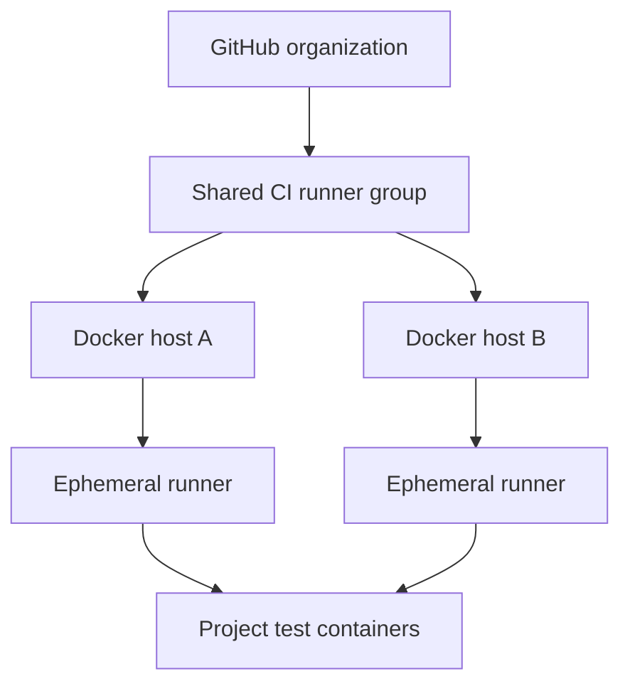
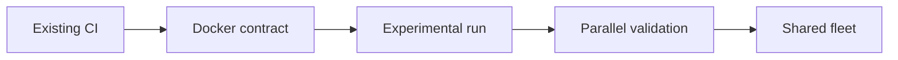

# ci-fleet

Portable, ephemeral, Dockerized GitHub Actions runner infrastructure for self-hosted environments.

> Status: an inert ephemeral Docker runner prototype now builds in CI. It does not register a live runner and is not production-ready.

## Goal

Run identical GitHub Actions worker containers across one or many Docker hosts while allowing each project to define its own containerized test environment.

A host may be a Proxmox VM, physical computer, remote-site machine, or VPS. Adding a host or increasing runner capacity should not require redesigning project workflows.



## Core model

- The fleet supplies generic ephemeral GitHub runners.
- Each runner accepts one job and is then destroyed.
- Each project supplies its own test Dockerfile, services, and commands.
- Normal CI uses a shared organization-level runner pool.
- Release, deployment, repository-writing, and internal-network jobs remain separated.
- Hosts apply automatic security maintenance and capacity-aware cleanup.
- Long-lived credentials remain in the controller or an external secret manager, never in job containers.
- Existing projects migrate through parallel validation with an explicit rollback path.

## Project contract

Every participating project must expose:

```bash
./scripts/ci/run.sh fast
./scripts/ci/run.sh full
```

Those commands must execute project validation inside project-owned containers. The fleet runner image does not carry project runtimes.

The mandatory rules are defined in the [Project CI Standard](docs/PROJECT-STANDARD.md). Existing projects follow [Migrating Existing CI](docs/MIGRATING-EXISTING-CI.md) and must complete the [Compliance Checklist](docs/COMPLIANCE-CHECKLIST.md).

## Why this exists

The initial infrastructure audit found persistent repository-specific runners, inconsistent cleanup, project dependencies installed directly on some runner hosts, fixed Docker names and ports that prevent concurrency, and privileged jobs sharing labels with ordinary validation.

The first implementation will therefore be deliberately small: one experimental runner and one manual read-only smoke workflow running beside existing CI.

## Responsibility boundaries

| Location | Responsibility |
| --- | --- |
| `ci-fleet` | Runner image, lifecycle controller, host bootstrap, maintenance, cleanup policy, hard CI rules, reusable workflow interfaces |
| Project repository | Test image, standard CI entrypoint, services, test commands, fixtures, migrations, project secrets, run-scoped cleanup |
| Host-local configuration | Real organization settings, capacity, credentials, network policy, monitoring and maintenance windows |

## Migration model



Existing required checks remain available until the new path has passed equivalent tests, cleanup checks, permission review, and rollback verification.

## Security

A runner with access to a Docker daemon must be treated as host-privileged. Multiple runner containers sharing one Docker daemon increase concurrency but do not provide independent security boundaries.

Never commit credentials or real deployment configuration. See [SECURITY.md](SECURITY.md) and [docs/SECRETS.md](docs/SECRETS.md).

## Documentation

### Mandatory standards

- [Project CI Standard](docs/PROJECT-STANDARD.md)
- [Migrating Existing CI](docs/MIGRATING-EXISTING-CI.md)
- [Project Compliance Checklist](docs/COMPLIANCE-CHECKLIST.md)

### Design and operations

- [Architecture](docs/ARCHITECTURE.md)
- [Controller decision record](docs/adr/0001-actions-scale-set-client.md)
- [Experimental deployment prototype](docs/DEPLOYMENT-PROTOTYPE.md)
- [Sanitized discovery summary](docs/DISCOVERY-SUMMARY.md)
- [Roadmap](docs/ROADMAP.md)
- [Secrets model](docs/SECRETS.md)
- [Agent instructions](AGENTS.md)
- [Third-party notices](THIRD_PARTY_NOTICES.md)

### Copyable examples

- [Experimental read-only workflow](examples/workflows/experimental-smoke.yml.example)
- [Standard project entrypoint](examples/project/scripts/ci/run.sh)
- [Isolated Compose project](examples/project/compose.ci.yaml)
- [Node test image](examples/project/Dockerfile.test)

Examples are starting points. Projects must replace placeholder action references and pin reviewed container images before production use.

## First live milestone

After the inert prototype passes validation, the first separately authorized live proof of concept must:

1. register one runner under a new experimental label;
2. accept exactly one manually triggered read-only job;
3. use `permissions: contents: read`;
4. leave no job-owned container, network, volume, or workspace residue;
5. keep all existing project CI unchanged;
6. demonstrate a rollback that removes only the experimental path.

## License

Original work in this repository is released under [the Unlicense](LICENSE).
