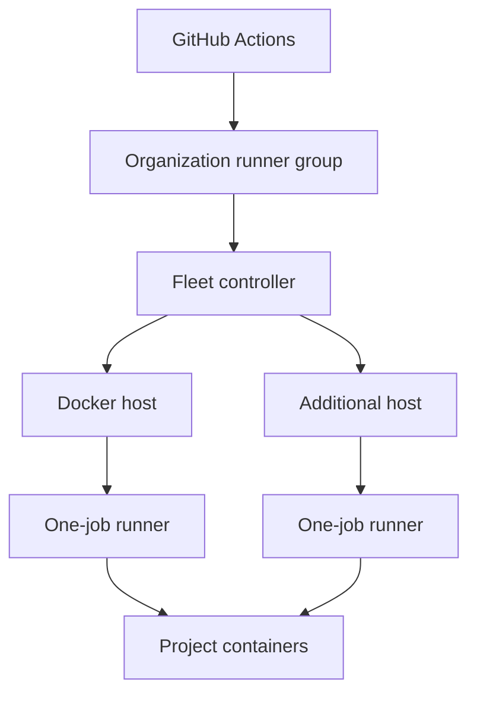
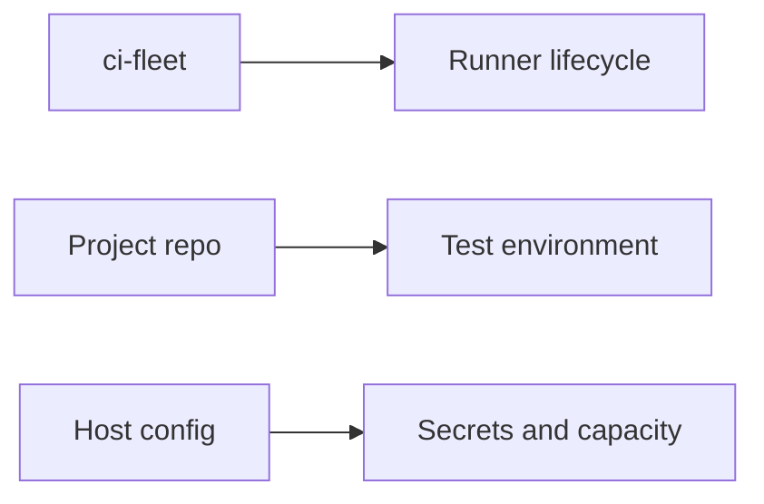
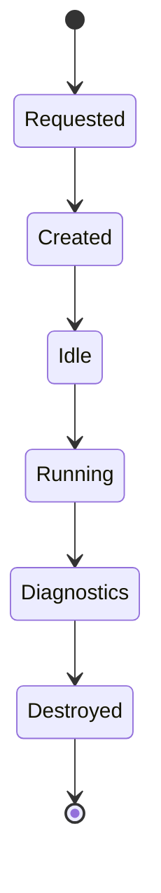
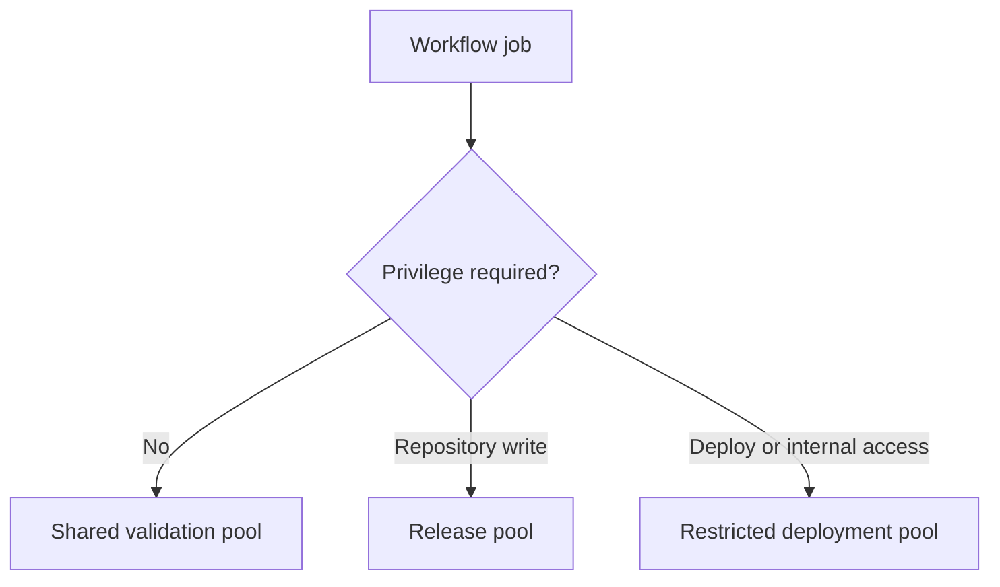
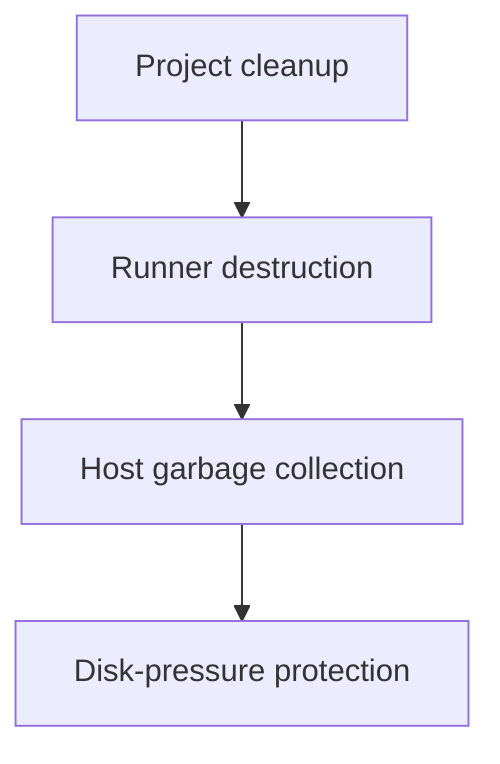

# Architecture

Status: design draft

## Objective

Provide a portable fleet of identical self-hosted GitHub Actions runners that can serve multiple explicitly authorized repositories. Each project owns its test environment; the fleet owns runner lifecycle, host maintenance, capacity, and common workflow behavior.

## System topology

A host may run multiple runners when resource measurements and project isolation permit it. Runners sharing a Docker daemon share one security boundary.

## Responsibility boundaries

### Fleet repository

The fleet is responsible for:

- runner image construction;
- organization-level runner routing;
- ephemeral runner creation and destruction;
- controller authentication;
- host bootstrap and validation;
- resource limits;
- health monitoring and external logs;
- safe garbage collection;
- unattended security maintenance;
- reusable workflow interfaces;
- hard project CI rules and onboarding documentation.

### Project repositories

Each project is responsible for:

- its test Dockerfile;
- its service definitions;
- the standard `scripts/ci/run.sh` entrypoint;
- its fast, full, smoke, and integration commands;
- test fixtures and migrations;
- project-specific secrets;
- run-scoped Compose names and resource labels;
- run-scoped cleanup;
- release and deployment behavior.

### Deployment-local configuration

Each installation is responsible for:

- real organization and runner-group names;
- host capacity;
- private network rules;
- secret provisioning;
- host inventory;
- monitoring destinations;
- maintenance windows.

Deployment-local values must not be committed to this public repository.

## Target runner lifecycle

1. The controller authenticates to GitHub using a GitHub App.
2. GitHub reports demand for the configured runner scale set.
3. The controller generates a short-lived just-in-time runner configuration.
4. The host creates an ephemeral runner container with defined resource limits.
5. The runner accepts one job.
6. The job launches the project-defined test containers.
7. Project cleanup removes only resources belonging to that workflow run.
8. Logs and failure diagnostics are retained outside the ephemeral runner.
9. The runner container and writable state are destroyed.
10. Capacity is reconciled against current demand.

## Job routing

Project-controlled inputs must not allow an ordinary validation job to select a privileged runner group.

## Deployment shapes

The same fleet interface should support:

- one Docker host with one or more runners;
- several Docker hosts with one or more runners each;
- Proxmox virtual machines;
- dedicated physical computers;
- remote-site computers;
- VPS infrastructure.

Kubernetes is not an initial requirement. The architecture should not prevent a later Kubernetes implementation.

## Cleanup layers

Host-wide pruning must not run as an uncoordinated per-job operation. Hard cancellation and host failure may bypass project traps, so resources must remain identifiable by run and age.

## Update layers

- Project runtime versions are controlled by project Dockerfiles.
- Runner versions are controlled by versioned fleet images.
- Host security updates are applied automatically.
- Reboots drain runner capacity before interrupting the host.
- Fleet updates use rolling replacement and an explicit rollback version.

## Project adoption

All projects must follow the [Project CI Standard](PROJECT-STANDARD.md). Existing workflows must use the staged process in [Migrating Existing CI](MIGRATING-EXISTING-CI.md).
