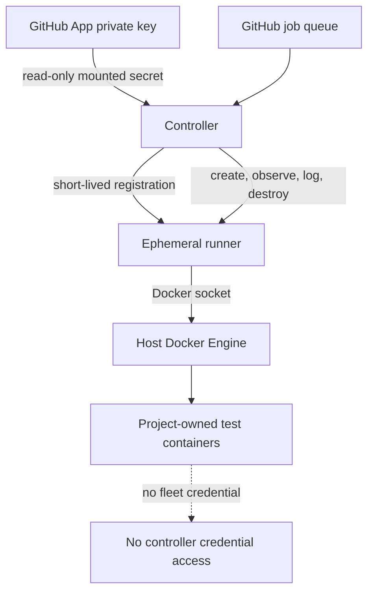

# Runner controller design

## Purpose

The controller turns GitHub job demand into disposable Dockerized GitHub Actions runners. It lets trusted private repositories share idle capacity without installing project runtimes directly on fleet hosts.

A persistent runner service per VM fragments capacity and retains job state. This controller instead creates one runner for one job and destroys it afterward.

## How it works

The controller:

1. authenticates to GitHub with a GitHub App;
2. watches demand for its uniquely named scale set;
3. generates short-lived just-in-time runner configuration;
4. creates a runner container with resource limits, rotated logs, ownership labels, and the Docker socket;
5. observes one assigned job;
6. retains final diagnostics outside the disposable runner;
7. destroys the runner and its writable state;
8. reconciles capacity with current demand.

On restart, it recovers only stale runners carrying the same fleet-instance label. It does not manage unrelated Docker workloads or another host's scale set.

## Security boundary

Docker socket access is host-root-equivalent. This pool is therefore limited to trusted repositories and trusted workflow revisions. Containers provide repeatability and cleanup; they do not make hostile workflow code safe.

The GitHub App private key exists only as a file-mounted controller secret. A runner receives only its short-lived registration configuration. Project secrets remain in GitHub repository or environment settings and are supplied only to jobs that explicitly require them.

## Choosing a runner model

ci-fleet is optimized for organizations that already operate Linux and Docker hosts, trust the repositories using the pool, and want idle capacity shared across projects. Other runner models may fit different requirements.

| Runner model | Good fit | Important tradeoff |
| --- | --- | --- |
| Persistent self-hosted runner | A small setup with one trusted repository and minimal orchestration | Workspaces and process state can survive between jobs, and idle capacity stays tied to that runner |
| Repository-specific runners sharing one host | Projects that require distinct GitHub registration or routing | Multiple services may compete for the same CPU, memory, disk, ports, and Docker daemon |
| Ephemeral Docker runners with ci-fleet | Multiple trusted repositories sharing Linux or Docker capacity across one or many locations | Runners are disposable, but jobs sharing a Docker daemon remain inside one host security boundary |
| Actions Runner Controller on Kubernetes | Organizations that already operate Kubernetes and want Kubernetes-native scaling | Requires a Kubernetes control plane and its associated operations |
| Disposable VM per job | Higher-isolation or higher-risk workloads | Stronger separation costs more startup time, storage, and provisioning infrastructure |
| GitHub-hosted runners | Teams that prefer managed capacity and do not require self-hosted resources or networks | Provides less control over hardware, locality, caching, and private infrastructure access |

The current controller uses the official `actions/scaleset` client at a pinned revision. Updates require a reviewed build and live validation before rollout.

## Operations and rollback

Hosts must be treated as disposable infrastructure, patched automatically, monitored for disk pressure, and restricted to trusted jobs.

To roll back an experimental controller:

1. stop new capacity;
2. confirm no managed job is active;
3. stop the controller;
4. run scoped cleanup for that fleet instance;
5. verify that host's scale set is absent from GitHub;
6. restore the last reviewed image and configuration if needed.

Existing project-specific CI remains available until migration validation is complete.
