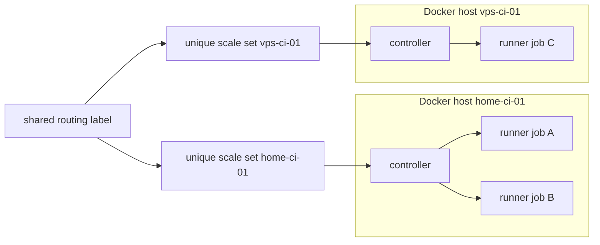

# Experimental deployment prototype

This is a reviewable deployment unit, not authorization to register a runner. Phase 2 validation builds it without credentials. A later issue must explicitly authorize GitHub App creation and the first live scale set.

## Host shape

One Docker host may run one controller and many single-use runner containers, up to the configured CPU and memory capacity. Additional hosts use the identical Compose files with a unique `CI_FLEET_INSTANCE` and unique `CI_FLEET_SCALE_SET_NAME`; compatible hosts share `CI_FLEET_LABELS` so GitHub can route matching jobs across the fleet.



Start conservatively with `MIN=0` and `MAX=1` on one isolated host. Raise concurrency only after observing CPU, memory, disk, network, port, and cache behavior.

## Filesystem layout

```text
/opt/ci-fleet/                  repository checkout
/etc/ci-fleet/ci-fleet.env     non-secret deployment configuration (0600)
/etc/ci-fleet/secrets/          root-owned directory (0700)
└── github-app.pem              GitHub App private key (0600)
```

Never put the PEM, PATs, project secrets, or a real `.env` file in this repository. GitHub Actions secrets/environments remain the source of job secrets.

## Build and start

From a pinned checkout of this repository:

```bash
set -a
. /etc/ci-fleet/ci-fleet.env
set +a
docker compose -f deploy/compose.yaml build runner-image controller
docker compose -f deploy/compose.yaml up -d --no-deps controller
```

The controller refuses to start if required settings or the secret file are absent. It also refuses to proceed unless the named runner image already exists on that Docker host.

## Maintenance

Install `scripts/healthcheck.sh` as a frequent systemd timer or monitoring probe. Install `scripts/cleanup.sh --apply --instance HOST-ID` as a separate timer after first reviewing its default dry-run output. Cleanup never uses global prune and never removes active containers.

Use the operating system's unattended-security-upgrade mechanism for security patches. Reboot scheduling is host-specific: drain by setting the controller's maximum to zero or stopping it, confirm jobs have finished, reboot, then restore it. Automatic upgrades must not silently replace pinned runner/controller images; image upgrades go through repository validation.

## Rollback

```bash
docker compose -f deploy/compose.yaml stop controller
CI_FLEET_INSTANCE=HOST-ID scripts/cleanup.sh
```

Inspect the dry-run. After confirming there is no active job, rerun with `--apply`. Do not delete unrelated Docker resources. Removal of the GitHub-side scale set is normally performed by the controller during graceful shutdown; verify it in GitHub before deleting the App installation.

### Recover an orphaned idle scale set

An unclean controller exit can leave its exact GitHub-side scale-set name behind and make the replacement fail with `already exists`. Use the controller's `--delete-idle-scale-set` administrative mode only after all of these are true:

- the selected scale-set name and runner group come from trusted installed configuration;
- no repository workflow targeting its label is queued or running;
- local managed runner count and project-container residue are both zero;
- the administrative controller image was built from a reviewed public commit.

The command looks up only the configured runner group and exact scale-set name. It refuses deletion unless GitHub reports zero available, acquired, assigned, and running jobs and zero registered, busy, and idle runners. It prints no scale-set ID or credential data. After deletion, restart the previous controller first; recreating the same empty scale set and passing healthcheck is the rollback/recovery proof before desired-state adoption continues.
