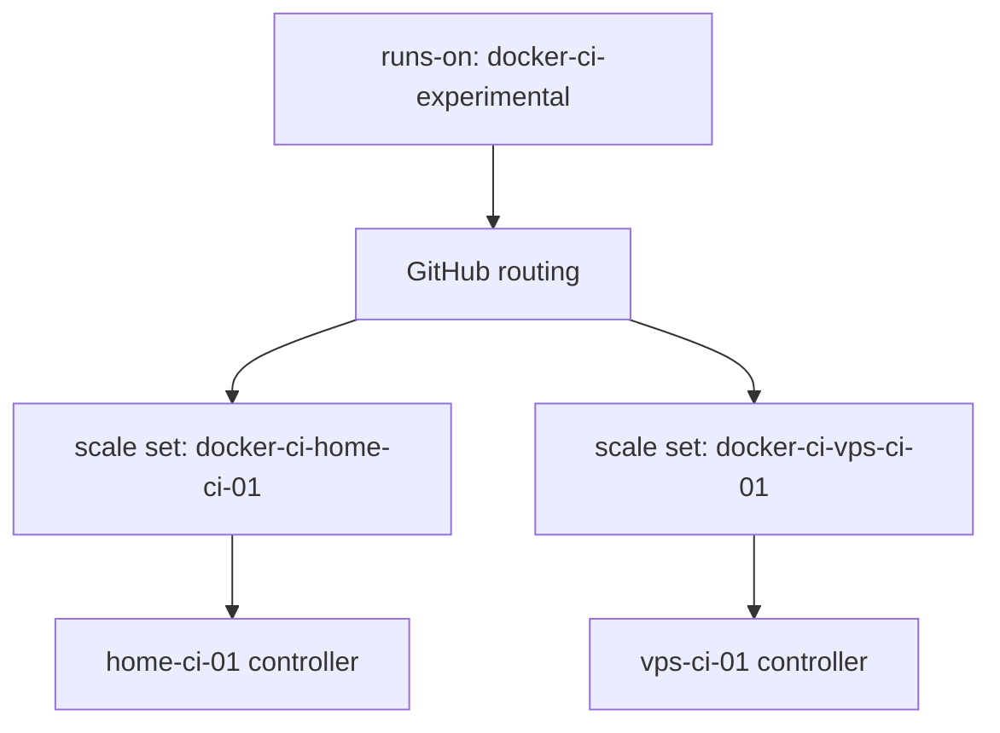

# Live pilot runbook

This runbook implements [issue #7](https://github.com/RandomDevelopment/ci-fleet/issues/7). It deliberately stops short of selecting a host, creating a GitHub App, or modifying a private project repository.

## Safety model

`ci-fleet` is public and must not receive access to the self-hosted runner group. GitHub warns that pull requests from forks of public repositories can potentially execute dangerous code on self-hosted machines. Copy the pilot workflow into exactly one trusted private repository and restrict the experimental runner group to that repository.

The runner has Docker socket access and must be treated as host-root-equivalent. The pilot must run on an isolated host with no production services, sensitive mounts, SSH agent, cloud metadata credential, or unrelated Docker workload.

## Fleet identity model

Every controller owns a unique scale set. Controllers share a routing label, which lets compatible jobs use any host without one controller deleting another host's scale set.



For the first pilot, deploy only one host:

```dotenv
CI_FLEET_INSTANCE=home-ci-01
CI_FLEET_SCALE_SET_NAME=docker-ci-home-ci-01
CI_FLEET_LABELS=docker-ci-experimental
CI_FLEET_MIN_RUNNERS=0
CI_FLEET_MAX_RUNNERS=1
```

## 1. Select the pilot repository and host

Choose one:

- a new private repository used only for the pilot; or
- one existing trusted private repository with the workflow limited to `workflow_dispatch`.

Do not change an existing required check. The host must be disposable and must not run production Docker workloads.

## 2. Create the organization runner group

In the organization settings, open **Actions → Runner groups** and create `trusted-private-ci-experimental`.

- Repository access: **Selected repositories**.
- Select only the pilot private repository.
- Do not override the default that prevents public repository access.

If the organization plan or UI does not permit a separate runner group, stop and record that limitation on issue #7. Do not silently place the pilot in a broadly accessible default group.

GitHub's current runner-group instructions are at <https://docs.github.com/en/actions/how-tos/manage-runners/self-hosted-runners/manage-access>.

## 3. Create the GitHub App

Create an organization-owned GitHub App. It does not need a webhook or callback URL for this controller.

Required permissions for organization-scoped runners:

- Repository permissions → Metadata: **Read-only** (automatic).
- Organization permissions → Self-hosted runners: **Read and write**.
- Repository Administration: **No access** for organization-scoped registration.

Install the App only on the target organization. Record its Client ID (the App ID also works with the pinned client) and installation ID. Generate one private key and transfer it directly to the pilot host. The official authentication instructions are at <https://docs.github.com/en/actions/how-tos/manage-runners/use-actions-runner-controller/authenticate-to-the-api>.

Do not paste the PEM into chat, an issue, a workflow secret, an environment variable, or a repository file.

## 4. Prepare host-local configuration

```bash
sudo install -d -m 0700 /etc/ci-fleet/secrets
sudo install -m 0600 -o root -g root DOWNLOADED-KEY.pem /etc/ci-fleet/secrets/github-app.pem
sudo install -m 0600 -o root -g root deploy/ci-fleet.env.example /etc/ci-fleet/ci-fleet.env
```

Edit the environment file locally. Set the Docker socket's numeric group with:

```bash
stat -c '%g' /var/run/docker.sock
```

Then load the non-secret configuration and run preflight:

```bash
set -a
. /etc/ci-fleet/ci-fleet.env
set +a
scripts/preflight.sh
```

Proceed only when the final line is `PREFLIGHT_OK warnings=0`.

## 5. Build without starting

```bash
docker compose -f deploy/compose.yaml build runner-image controller
docker image inspect "$CI_FLEET_RUNNER_IMAGE" >/dev/null
docker image inspect "$CI_FLEET_CONTROLLER_IMAGE" >/dev/null
```

Rerun preflight. Capture only the pass/fail summary, not environment contents.

## 6. Start at zero and observe

```bash
docker compose -f deploy/compose.yaml up -d --no-deps controller
docker compose -f deploy/compose.yaml logs --tail=100 controller
docker ps --filter label=io.randomdevelopment.ci-fleet.managed=true
```

With `MIN=0`, there must be no runner container before a job is dispatched. Confirm the uniquely named scale set is visible in the experimental runner group.

## 7. Run exactly one job

Copy `examples/workflows/live-pilot.yml.example` into the selected private repository. Commit it without changing existing CI, then manually dispatch it once.

Observe one runner container appear. After the job completes, confirm:

```bash
docker ps -a --filter label=io.randomdevelopment.ci-fleet.managed=true
CI_FLEET_INSTANCE="$CI_FLEET_INSTANCE" scripts/cleanup.sh
scripts/healthcheck.sh
```

Expected results: no runner container, no expired resource candidate, and healthy Docker/controller/disk checks.

## 8. Roll back the pilot

```bash
docker compose -f deploy/compose.yaml stop controller
CI_FLEET_INSTANCE="$CI_FLEET_INSTANCE" scripts/cleanup.sh
```

Inspect the dry-run before using `--apply`. Verify the host's uniquely named scale set is absent from GitHub. Remove the pilot workflow from the private repository and revoke its runner-group access. If abandoning ci-fleet, uninstall the App and securely delete the host PEM.

Existing MailThisForMe and TF2 runner services remain unchanged throughout this pilot.
