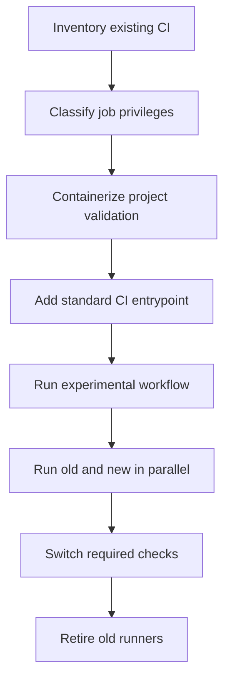

# Migrating Existing CI

Existing CI must be transformed incrementally. Do not replace a working required workflow with an unproven shared workflow.

## Migration flow



## Step 1: Inventory without changes

Record:

- triggers;
- runner labels;
- permissions;
- secrets by name;
- runtime dependencies;
- commands and expected artifacts;
- Docker resources;
- ports, volumes, and caches;
- cleanup behavior;
- release and deployment side effects;
- rollback behavior.

The original workflow remains authoritative during this step.

## Step 2: Classify every job

| Class | Examples | Target |
| --- | --- | --- |
| Read-only validation | build, lint, unit tests, smoke tests | Shared CI pool |
| Integration validation | migrations and disposable databases | Shared CI pool after isolation |
| Repository mutation | create PR, update schema, push deployable ref | Separate privileged pool |
| Deployment | SSH, production Compose, migrations | Separate deployment pool |
| Internal infrastructure | management-network access | Restricted internal pool |

Do not move a whole workflow merely because one job is read-only. Split mixed workflows so each job receives only the permissions and runner access it requires.

## Step 3: Move runtimes into project containers

Create or adapt the project's test image so the runner host no longer supplies the language runtime or dependencies.

The runner host should not determine whether a project needs Node 22, PHP 8.4, PostgreSQL 16, or a future runtime. Those versions belong to the project.

## Step 4: Add the standard adapter

Add:

```text
scripts/ci/run.sh fast
scripts/ci/run.sh full
```

The adapter may call existing scripts. This allows a mature Dockerized project to preserve working orchestration while presenting the same interface as a newly containerized project.

## Step 5: Eliminate shared-host collisions

Before using a shared host:

- remove fixed `container_name` values;
- remove fixed host port bindings;
- use service DNS on internal Compose networks;
- derive the Compose project name from the workflow run;
- make caches explicitly namespaced;
- ensure cleanup targets only the current run.

## Step 6: Add an opt-in experimental workflow

The first workflow MUST:

- use `workflow_dispatch` only;
- use the experimental runner label;
- declare `permissions: contents: read`;
- set a timeout;
- run one non-destructive suite;
- leave the existing required workflow unchanged.

See [the experimental example](../examples/workflows/experimental-smoke.yml.example).

## Step 7: Parallel validation

Run both paths on the same commits and compare:

- pass/fail results;
- generated artifacts;
- suite duration;
- CPU, memory, disk, and cache growth;
- containers, networks, volumes, and workspaces remaining afterward;
- behavior after cancellation and forced failure.

Differences require explanation before cutover.

## Step 8: Cut over read-only checks

Only after parallel validation:

1. add the shared workflow as a required check;
2. observe successful runs;
3. remove the old check from required status;
4. preserve the old workflow and runner temporarily for rollback;
5. retire project-specific validation runners after the observation period.

## Step 9: Migrate privileged jobs separately

Repository mutation and deployment are separate projects. They require their own:

- permissions;
- runner group;
- network boundary;
- secrets;
- approval rules;
- rollback procedure.

Successful migration of read-only CI does not authorize moving privileged jobs.

## Rollback rule

Every migration pull request MUST state exactly how to restore the previous workflow and runner selection. Until retirement, rollback should require changing only workflow routing, not rebuilding a host.
