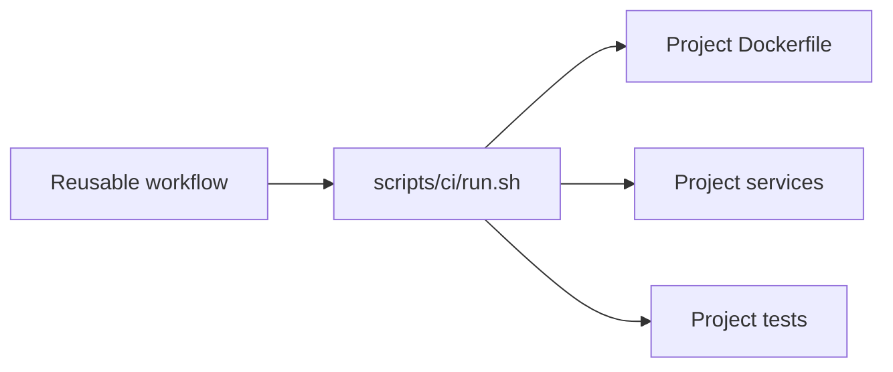
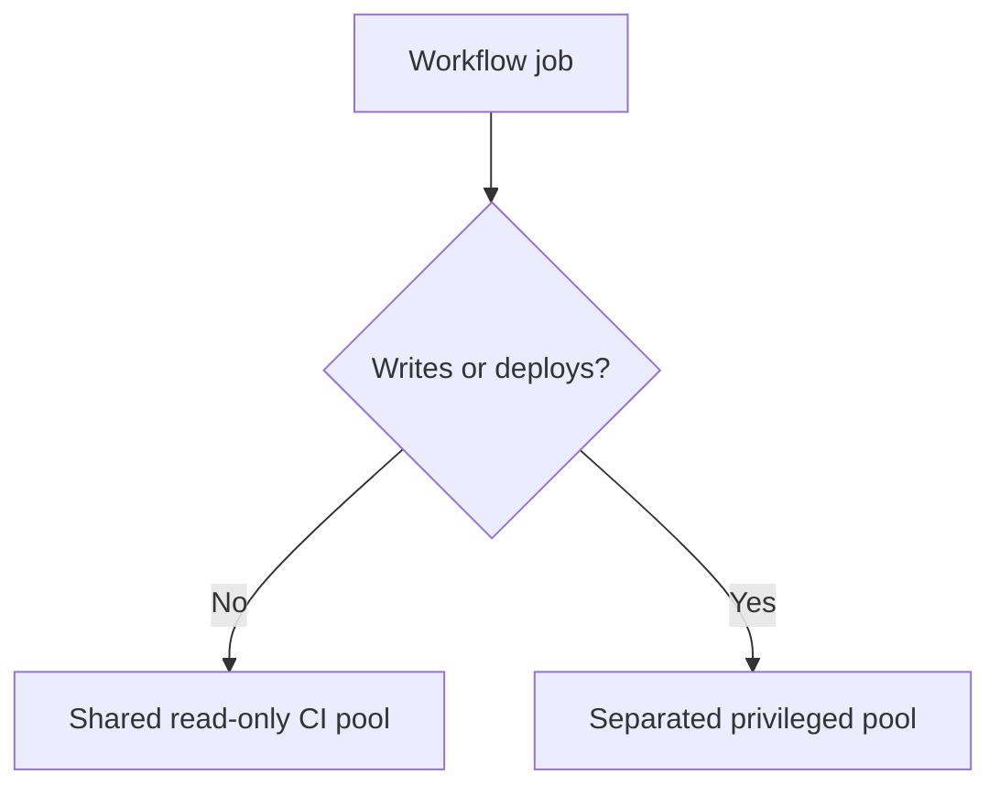

# Project CI Standard

Status: normative design contract

The key words **MUST**, **MUST NOT**, **REQUIRED**, **SHOULD**, and **SHOULD NOT** describe requirements for projects using ci-fleet.

## Required repository interface

Every participating project MUST provide one executable entrypoint:

```text
scripts/ci/run.sh <suite>
```

Supported suites SHOULD include:

- `fast`: syntax, formatting, build, unit tests, and short smoke validation;
- `full`: integration tests, migrations, database validation, and complete behavior tests.

A project MAY support additional suites, but the shared fleet MUST NOT contain project-specific test logic.

Existing scripts do not need to be discarded. The standard entrypoint MAY delegate to an established project script.



## Host independence

A project CI job:

- MUST run application build and validation inside project-owned containers;
- MUST NOT require Node, PHP, Python, Java, Composer, npm, database clients, or other project runtimes installed on the runner host;
- MAY assume only Linux, Git, Bash, Docker Engine, Docker Compose, and the GitHub runner interface;
- MUST use the same project test image locally and in CI;
- MUST pin runtime versions in project-owned image definitions.

## Docker isolation

A project:

- MUST use a unique Compose project name derived from repository, workflow run ID, and run attempt;
- MUST NOT set fixed `container_name` values;
- MUST NOT publish fixed host ports;
- SHOULD run tests against service names on an internal Compose network;
- MUST label fleet-created resources with repository and run identity when Compose does not already provide sufficient identity;
- MUST NOT use host networking;
- MUST NOT mount the host root filesystem or unrelated host paths;
- MUST NOT invoke unrestricted `docker system prune`;
- MUST remove its run-owned containers, networks, and disposable volumes after success or failure.

Recommended project name construction:

```bash
repo_slug="${GITHUB_REPOSITORY#*/}"
raw_name="ci-${repo_slug}-${GITHUB_RUN_ID:-local}-${GITHUB_RUN_ATTEMPT:-1}"
COMPOSE_PROJECT_NAME="$(printf '%s' "$raw_name" |
  tr '[:upper:]' '[:lower:]' |
  tr -cs 'a-z0-9_-' '-' |
  cut -c1-63)"
export COMPOSE_PROJECT_NAME
```

## Cleanup contract

The project entrypoint MUST register cleanup before creating Docker resources:

```bash
cleanup() {
  docker compose -f compose.ci.yaml down --remove-orphans --volumes
}
trap cleanup EXIT INT TERM
```

Project cleanup is the first layer, not the only layer. Ephemeral runner destruction and host garbage collection remain fleet responsibilities.

Cancellation, host failure, or Docker daemon failure may bypass a shell trap. Therefore, every resource MUST remain identifiable by run and age so fleet cleanup can safely remove abandoned state later.

## Workflow permissions

Ordinary CI:

- MUST declare `permissions: contents: read`;
- MUST NOT receive deployment, release, production, or internal-network credentials;
- MUST NOT push branches, tags, releases, packages, or commits;
- MUST set a job timeout;
- SHOULD use concurrency controls appropriate to the project;
- MUST treat pull-request code as untrusted unless repository policy explicitly establishes otherwise.

A job requiring write permission is not ordinary CI. It MUST be a separate job or workflow routed to an appropriate privileged runner group.

## Secrets

- Normal validation SHOULD require no secret.
- Required test secrets MUST be explicitly named and passed by the calling project.
- Reusable workflows MUST NOT use blanket secret inheritance by default.
- Secrets MUST NOT be written into images, image layers, artifacts, caches, or logs.
- Fork pull-request workflows MUST NOT receive repository secrets or write tokens.
- Long-lived fleet controller credentials MUST be unavailable to all job containers.

## Privileged workload separation

The following MUST NOT use the normal shared CI runner group:

- production or development deployment;
- release publication;
- branch or tag mutation;
- schema update jobs that commit changes;
- package publication;
- jobs requiring production or internal-management network access.



## Reproducibility

A project MUST document a local command that exercises the same entrypoint used by GitHub:

```bash
./scripts/ci/run.sh fast
./scripts/ci/run.sh full
```

CI-only behavior SHOULD be limited to run identity, artifact upload, and GitHub status reporting.

## Required verification before migration

A project is not compliant until all of these pass:

- fast suite locally through Docker;
- full suite locally through Docker;
- manual experimental fleet run;
- parallel old/new CI comparison;
- forced failure cleanup;
- canceled job cleanup;
- repeated run with no fixed-name or fixed-port collision;
- proof that ordinary CI has read-only permissions;
- proof that privileged secrets are absent;
- rollback to the existing runner path.
