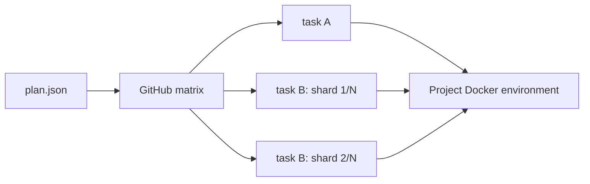
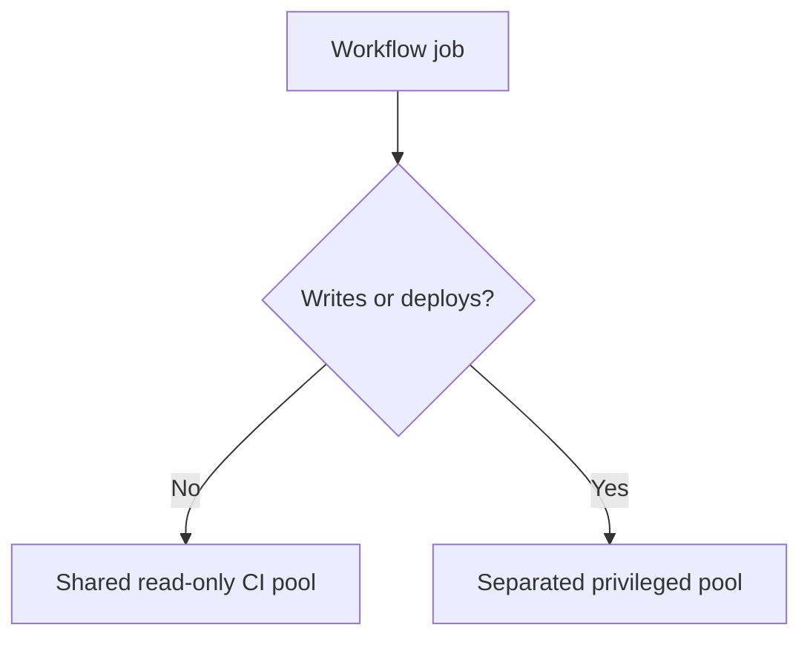

# Project CI Standard

Status: normative design contract

The key words **MUST**, **MUST NOT**, **REQUIRED**, **SHOULD**, and **SHOULD NOT** describe requirements for projects using ci-fleet.

## Required repository interface

Every participating project MUST provide:

```text
scripts/ci/plan.json
scripts/ci/run.sh <task> --shard INDEX/TOTAL
```

The task plan MUST declare named, independently runnable tasks, their `fast` and/or `full` group membership, deterministic shard counts, and expected minutes per shard. Task IDs MUST NOT use the reserved aggregate names `fast` or `full`.

Projects MUST also preserve these aggregate developer interfaces:

```bash
./scripts/ci/run.sh fast
./scripts/ci/run.sh full
```

The fleet MUST schedule the named task shards, not the aggregate command. Aggregate commands exist for local reproduction, migration compatibility, and constrained environments with only one worker.

Existing scripts do not need to be discarded. The standard entrypoint MAY delegate to established project scripts, but the shared fleet MUST NOT contain project-specific test logic.



## Five-minute scheduling objective

Ordinary CI MUST target a wall-clock duration of five minutes or less when sufficient workers are available.

- Every task-matrix job MUST set `timeout-minutes: 5`.
- Expected test payload per shard MUST be four minutes or less, reserving time for checkout, container startup, and reporting.
- Sharding MUST be deterministic: the same revision and `INDEX/TOTAL` pair select the same work.
- Tasks and shards SHOULD be balanced using measured historical duration rather than test count.
- Projects MUST split, optimize, or move any indivisible test that cannot fit the ordinary five-minute job ceiling.
- A task plan MUST expand to no more than GitHub's 256-job matrix limit.

Forty-five test-minutes divided among nine workers is a theoretical five-minute lower bound. Real plans generally need more than nine shards because job setup consumes part of the ceiling and test work is not perfectly balanced. Adding workers reduces wall-clock time only while runnable shards remain queued.

## Host independence

A project CI job:

- MUST run application build and validation inside project-owned containers;
- MUST NOT require Node, PHP, Python, Java, Composer, npm, database clients, or other project runtimes installed on the runner host;
- MAY assume only Linux, Git, Bash, Docker Engine, Docker Compose, and the GitHub runner interface;
- MUST use the same project test image locally and in CI;
- MUST pin runtime versions in project-owned image definitions.

## Docker isolation

A project:

- MUST use a unique Compose project name derived from repository, workflow run ID, and run attempt;
- MUST NOT set fixed `container_name` values;
- MUST NOT publish fixed host ports;
- SHOULD run tests against service names on an internal Compose network;
- MUST label fleet-created resources with repository and run identity when Compose does not already provide sufficient identity;
- MUST NOT use host networking;
- MUST NOT mount the host root filesystem or unrelated host paths;
- MUST NOT invoke unrestricted `docker system prune`;
- MUST remove its run-owned containers, networks, and disposable volumes after success or failure.

Recommended project name construction:

```bash
repo_slug="${GITHUB_REPOSITORY#*/}"
task_slug="${CI_FLEET_TASK:-aggregate}"
shard_slug="${CI_FLEET_SHARD_INDEX:-1}of${CI_FLEET_SHARD_TOTAL:-1}"
raw_name="ci-${repo_slug}-${GITHUB_RUN_ID:-local}-${GITHUB_RUN_ATTEMPT:-1}-${task_slug}-${shard_slug}"
COMPOSE_PROJECT_NAME="$(printf '%s' "$raw_name" |
  tr '[:upper:]' '[:lower:]' |
  tr -cs 'a-z0-9_-' '-' |
  cut -c1-63)"
export COMPOSE_PROJECT_NAME
```

## Cleanup contract

The project entrypoint MUST register cleanup before creating Docker resources:

```bash
cleanup() {
  docker compose -f compose.ci.yaml down --remove-orphans --volumes
}
trap cleanup EXIT INT TERM
```

Project cleanup is the first layer, not the only layer. Ephemeral runner destruction and host garbage collection remain fleet responsibilities.

Cancellation, host failure, or Docker daemon failure may bypass a shell trap. Therefore, every resource MUST remain identifiable by run and age so fleet cleanup can safely remove abandoned state later.

## Workflow permissions

Ordinary CI:

- MUST declare `permissions: contents: read`;
- MUST NOT receive deployment, release, production, or internal-network credentials;
- MUST NOT push branches, tags, releases, packages, or commits;
- MUST set `timeout-minutes: 5` on every ordinary task-matrix job;
- SHOULD use concurrency controls appropriate to the project;
- MUST treat pull-request code as untrusted unless repository policy explicitly establishes otherwise.

A job requiring write permission is not ordinary CI. It MUST be a separate job or workflow routed to an appropriate privileged runner group.

## Secrets

- Normal validation SHOULD require no secret.
- Required test secrets MUST be explicitly named and passed by the calling project.
- Reusable workflows MUST NOT use blanket secret inheritance by default.
- Secrets MUST NOT be written into images, image layers, artifacts, caches, or logs.
- Fork pull-request workflows MUST NOT receive repository secrets or write tokens.
- Long-lived fleet controller credentials MUST be unavailable to all job containers.

## Privileged workload separation

The following MUST NOT use the normal shared CI runner group:

- production or development deployment;
- release publication;
- branch or tag mutation;
- schema update jobs that commit changes;
- package publication;
- jobs requiring production or internal-management network access.



## Reproducibility

A project MUST document both aggregate local commands and a representative direct shard:

```bash
./scripts/ci/run.sh fast
./scripts/ci/run.sh full
./scripts/ci/run.sh unit --shard 1/4
```

Local and CI execution MUST use the same project image and task implementation. CI-only behavior SHOULD be limited to matrix selection, run identity, artifact upload, and GitHub status reporting.

## Required verification before migration

A project is not compliant until all of these pass:

- task plan validation and deterministic matrix expansion;
- every declared task/shard through Docker;
- fast aggregate locally through Docker;
- full aggregate locally through Docker;
- measured evidence that ordinary shards fit the five-minute ceiling;
- manual experimental fleet run;
- parallel old/new CI comparison;
- forced failure cleanup;
- canceled job cleanup;
- repeated run with no fixed-name or fixed-port collision;
- proof that ordinary CI has read-only permissions;
- proof that privileged secrets are absent;
- rollback to the existing runner path.
