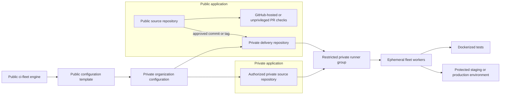

# Public projects, private delivery, and private configuration

ci-fleet is public so operators can inspect, reuse, review, and improve the engine. A real installation contains organization-specific topology and policy that should not be published. Secret values do not belong in either public or private Git history.

The fleet supports both private application repositories and public applications that use a separate private repository for privileged CI, release, and deployment.

## Supported repository models

A private application repository may use the restricted runner group directly. A public application repository does not. Its private delivery repository selects an approved public commit, runs the privileged work, and owns the deployment policy and secrets.

## What belongs where?

| Location | Contains |
| --- | --- |
| Public fleet repository | Schemas, generic controller and deployment code, validation, examples, standards, and reusable interfaces |
| Public configuration template | Fictional examples and the expected private-repository structure |
| Public application repository | Source code, public tests, public Dockerfiles, and unprivileged workflows |
| Private application repository | Source code and workflows authorized to use an appropriate private runner group |
| Private delivery repository for a public project | Approved source mappings, CI and deployment workflows, environment policy, promotion rules, and required secret names |
| Private organization configuration | Repository mappings, logical host groups, environment policy, capacity, image names, and internal operating notes |
| Secret manager, GitHub environment, or host-local protected file | Actual keys, tokens, passwords, and deployment credentials |

Each organization generates its own private installation configuration from the public [configuration template](../templates/config-repository/README.md). The resulting private repository is an implementation detail of that organization and is not required to be accessible to users of the public project.

## Public source with private CI and deployment

A public project can use fleet workers without granting the public repository access to them:

1. Pull requests run on GitHub-hosted runners or another unprivileged environment.
2. A maintainer, protected workflow, release tag, or trusted automation selects an approved commit.
3. The private delivery repository receives or records the exact public repository and full commit SHA.
4. It verifies that the repository, revision, branch or tag policy, and requested operation are allowed.
5. Its private workflow checks out that exact revision and runs the project's Dockerized tests on the fleet.
6. Deployment runs only through a protected private environment with the minimum required secrets and approvals.
7. Results and release metadata may be published back without exposing runner or deployment credentials.

The private delivery repository is the authorized GitHub Actions identity. Fleet hosts and worker images remain generic and do not contain the public project's name or credentials.

## Security requirements for public projects

- Never authorize the public source repository or its forks for a privileged self-hosted runner group.
- Never allow pull-request code to choose an arbitrary repository URL, Git ref, shell command, runner label, environment, or deployment target.
- Use a full immutable commit SHA and verify that it belongs to the approved public repository.
- Treat artifacts produced by an untrusted public workflow as untrusted; rebuild them privately or verify their provenance before signing or deployment.
- Keep the private delivery workflow, repository allowlist, promotion policy, and environment protections outside the public repository's control.
- Keep validation runners and deployment runners separated when deployment credentials or internal network access are involved.
- Give workflows and GitHub Apps only the permissions required for the selected operation.
- Ensure logs and published results cannot reveal private configuration or credentials.

## General rules

- Public repositories never receive direct access to privileged self-hosted runner groups.
- Reusable public workflow references are pinned to reviewed immutable commits.
- Public examples use fictional organizations, domains, repositories, hosts, and addresses.
- Private configuration may declare required secret names but never their values.
- GitHub App keys, tokens, project secrets, and deployment credentials stay outside Git history.
- Real private configuration is validated against the same public schema used by examples.
- A host remains generic; adding a repository changes policy and project configuration, not every worker image.

## Secret locations

Use one of these mechanisms according to the credential's scope:

- GitHub repository or environment secrets for job-specific credentials;
- root-owned host-local files for a small single-host controller;
- an external secret manager for a distributed or higher-assurance fleet.

See the [secrets model](SECRETS.md) and [security policy](../SECURITY.md) before configuring a live installation.
