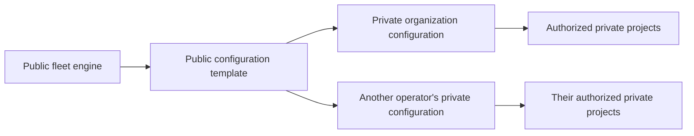

# Public engine and private configuration

ci-fleet is public so operators can inspect, reuse, review, and improve the engine. A real installation contains organization-specific topology and policy that should not be published. Secret values do not belong in either public or private Git history.

## Repository model

| Location | Contains |
| --- | --- |
| Public fleet repository | Schemas, generic controller and deployment code, validation, examples, standards, and reusable interfaces |
| Public configuration template | Fictional examples and the expected private-repository structure |
| Private organization configuration | Repository mappings, logical host groups, environment policy, capacity, image names, and internal operating notes |
| Secret manager, GitHub environment, or host-local protected file | Actual keys, tokens, passwords, and deployment credentials |

Each organization generates its own private installation configuration from the public [configuration template](../templates/config-repository/README.md). The resulting private repository is an implementation detail of that organization and is not required to be accessible to users of the public project.

## Rules

- Public repositories never receive access to privileged self-hosted runner groups.
- Reusable public workflow references are pinned to reviewed immutable commits.
- Public examples use fictional organizations, domains, repositories, hosts, and addresses.
- Private configuration may declare required secret names but never their values.
- GitHub App keys, tokens, project secrets, and deployment credentials stay outside Git history.
- Real private configuration is validated against the same public schema used by examples.
- A host remains generic; adding a repository changes policy and project configuration, not every worker image.

## Secret locations

Use one of these mechanisms according to the credential's scope:

- GitHub repository or environment secrets for job-specific credentials;
- root-owned host-local files for a small single-host controller;
- an external secret manager for a distributed or higher-assurance fleet.

See the [secrets model](SECRETS.md) and [security policy](../SECURITY.md) before configuring a live installation.
