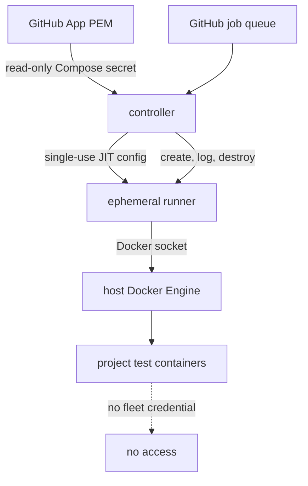

# ADR 0001: Official scale-set client with a ci-fleet Docker controller

- Status: Accepted for an isolated proof of concept
- Date: 2026-07-12
- Tracks: [#1](https://github.com/RandomDevelopment/ci-fleet/issues/1)
- Upstream revision: `actions/scaleset@9b2803251ede77816509dcd90aadc0690dd80763`

## Context

The fleet needs to share idle capacity across trusted repositories while keeping every project runtime in project-owned test images. A persistent runner service per VM wastes capacity and retains job state. GitHub's `actions/scaleset` project provides the official APIs and listener behavior needed to create just-in-time ephemeral runners. Its Docker example is explicitly simplified and not intended to be a production deployment.

## Decision

Use the official Go client at an immutable revision. Maintain a small controller here that adds the operational boundaries missing from the example:

The controller accepts GitHub App authentication only. It creates runner containers with CPU/memory limits, rotated logs, ownership/expiry labels, and the Docker socket. It emits the runner's final logs and destroys the container after one job. On restart it recovers only stale runners bearing the same fleet-instance label.

## Security boundary

Docker socket access is root-equivalent on the host. This pool is therefore only for trusted repositories and trusted workflow revisions. Containerization supplies repeatability and cleanup, not a security boundary against hostile workflow code.

The GitHub App private key exists only as a file-mounted controller secret. A runner receives a short-lived JIT configuration for its one registration. Project secrets remain in GitHub environments/repository settings and are supplied only to jobs that explicitly need them.

## Alternatives considered

- Persistent runner services on each VM: rejected as the target because state persists and idle capacity is fragmented.
- Multiple repository-scoped runner services per host: rejected because scheduling and resource contention become ambiguous.
- Actions Runner Controller on Kubernetes: deferred; Kubernetes would add an unnecessary control plane for the current one-server estate.
- Third-party Docker runner managers: not selected; the official client reduces protocol drift and avoids adopting a differently licensed codebase.
- One VM per job: strongest isolation, retained as a future tier for untrusted or high-risk workloads.

## Consequences

The controller depends on a public-preview API and requires deliberate upstream review before updates. Docker hosts must be treated as disposable infrastructure, patched automatically, monitored for disk pressure, and restricted to trusted jobs. Project workflows must satisfy `docs/PROJECT-STANDARD.md` before migration.

## Rollback

Stop the Compose controller, verify no managed runner containers remain, and remove the experimental scale set if GitHub still shows it. Existing repository-specific CI remains unchanged until a later migration phase, so rollback does not require restoring those workflows.

## Review cadence

Review the pinned upstream revision and GitHub runner release monthly and before every fleet image release. Update the pin only through a reviewed pull request with a successful inert validation build.
