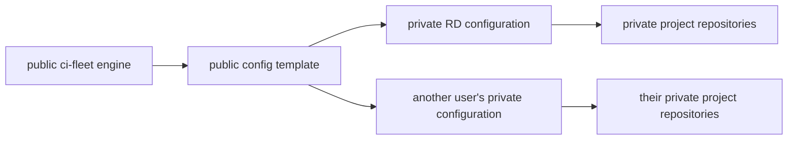

# ADR 0002: Public delivery engine with private organization configuration

- Status: Accepted
- Date: 2026-07-13
- Tracks: [#12](https://github.com/RandomDevelopment/ci-fleet/issues/12)

## Context

ci-fleet is expanding from runner lifecycle management into a container delivery standard. The reusable engine benefits from public documentation, review, examples, and an Unlicense release. Real deployments contain organization-specific topology and policy that should not be published. Neither public nor private Git repositories are appropriate secret stores.

## Decision

Keep ci-fleet public. Publish a separate public `ci-fleet-config-template` that users generate into private configuration repositories. Random Development will generate `rd-delivery-config` from the same public template used by everyone else.

The public engine owns schemas, reusable workflows, generic controller/deployment code, validation, examples, and policy. A private configuration repository owns real repository mappings, logical host groups, environment policies, capacity, image names, and internal operating notes.

Secret values remain in GitHub Environments, host-local root-owned files, or an external secret manager. Configuration may declare required secret names but never their values.

## Consequences

- Public reusable workflows must be called at immutable commit SHAs.
- Public repositories never receive access to self-hosted runners.
- Examples use fictional organizations, domains, repositories, and hosts.
- Real private configuration is validated against the same public schema.
- Publishing the controller does not weaken its security boundary; credentials, runner-group policy, environment protection, and host isolation remain authoritative.

## Rollback

The configuration template is additive. Organizations can stop consuming it without changing runner lifecycle code. Random Development can keep its configuration private or migrate it to another configuration system while retaining the public delivery standards.
