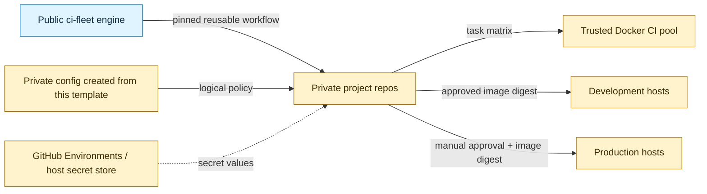
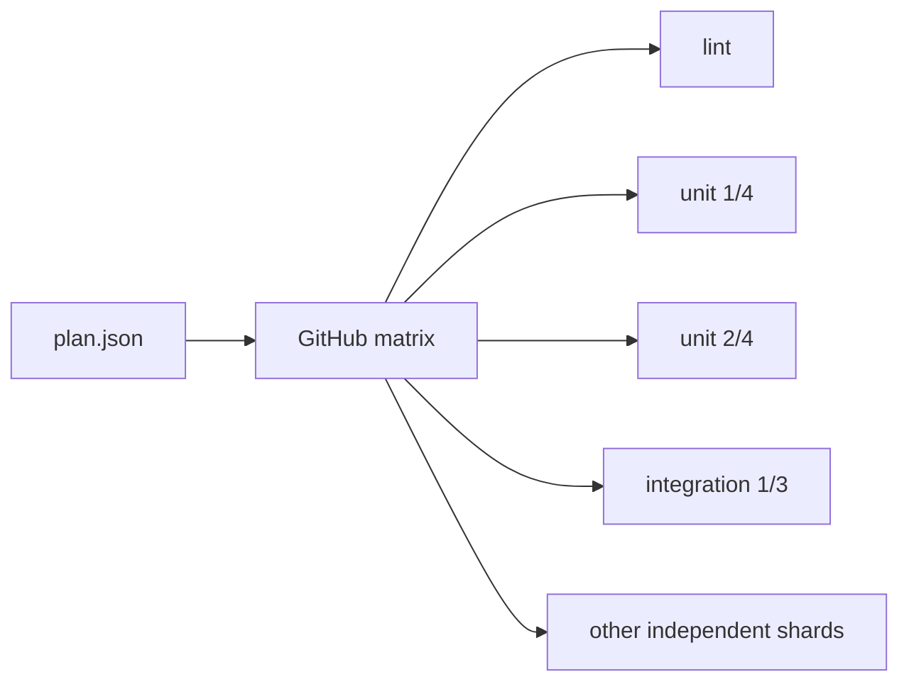

# ci-fleet configuration template

This is the public, secret-free starting point for an organization's private `ci-fleet` configuration repository. It records which trusted projects may use each CI pool, which logical deployment environments exist, and the standardized commands every project must expose.

It does **not** contain runner registration tokens, deploy credentials, private keys, host addresses, or `.env` files.



## Start a private organization configuration

1. Create a **private** repository from this public template.
2. Clone it and initialize the first project:

   ```bash
   ./scripts/init.sh --organization your-org --project your-app
   ```

3. Edit `fleet.json` to add the organization's real logical mappings.
4. Run the strict policy check:

   ```bash
   ./scripts/validate.sh --strict
   ```

5. Configure secret **values** in GitHub Environments or the deployment host's secret manager. The repository stores only names such as `DEPLOY_AUTH`.

The initializer refuses to replace a configured file unless `--force` is explicit. Run `./scripts/init.sh --help` for repository, registry, label, and output options.

## Hard rules

- Public repositories never receive access to the trusted self-hosted runner pool.
- Every project publishes `scripts/ci/plan.json` and implements `./scripts/ci/run.sh <task> --shard INDEX/TOTAL` in its own Docker-defined test environment.
- `./scripts/ci/run.sh fast` and `full` remain aggregate developer commands; fleet scheduling expands their named tasks across available workers.
- Every matrix job has a five-minute hard timeout, while expected test payload targets four minutes or less to reserve startup and reporting time.
- CI runner pools and deployment host groups are separate trust roles.
- Production deployment is manual and requires GitHub Environment approval.
- Reusable workflows and third-party actions are pinned to immutable commits.
- Configuration contains logical identifiers only. Secret values, private host details, and credentials never enter Git.
- Promoted artifacts are container image digests; production does not rebuild a different image.

`fleet.schema.json` provides editor completion and structural documentation. `scripts/validate.py` is the authoritative dependency-free policy check, including relationships JSON Schema cannot express clearly.

## Five-minute parallelism contract

Projects divide their total test-minutes into independent named tasks and deterministic shards. Forty-five test-minutes require at least nine perfectly balanced five-minute jobs in theory. In practice, projects should create additional shards targeting four minutes of test payload so checkout, image preparation, and reporting remain inside the five-minute job ceiling.



Adding workers reduces wall-clock time only while independent shards remain queued. A genuinely indivisible test longer than five minutes must be optimized, split, or moved into an explicitly slower scheduled class outside ordinary CI.

## Repository map

| Path | Purpose |
|---|---|
| `fleet.json` | Fictional, valid reference configuration to initialize or replace |
| `fleet.schema.json` | JSON Schema draft 2020-12 editor contract |
| `scripts/init.sh` | Safe first-project initializer |
| `scripts/validate.sh` | Structural, policy, and secret-boundary validation |
| `scripts/test_policy.py` | Regression tests proving unsafe configurations fail closed |
| `examples/multi-host/fleet.json` | Fictional two-project, multi-host topology |
| `SECURITY.md` | Secret handling and vulnerability reporting |
| `AGENTS.md` | Non-negotiable rules for humans and coding agents |

## Public and private boundary

| Safe in this public template | Belongs in the private config repo | Belongs only in a secret store |
|---|---|---|
| Schema, validator, fictional examples | Real repository names and logical host-group names | Tokens, passwords, private keys |
| Standard CI entrypoint names | Environment policy and allowed repository lists | Host addresses and SSH material |
| Reusable workflow references | Required secret **names** | `.env` contents and app credentials |

The public engine and this template use the [Unlicense](LICENSE). See [THIRD_PARTY_NOTICES.md](THIRD_PARTY_NOTICES.md) before copying third-party material into a derived repository.
