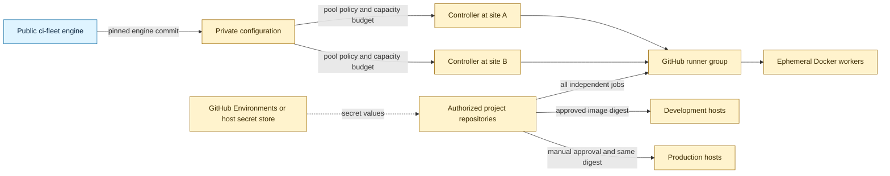
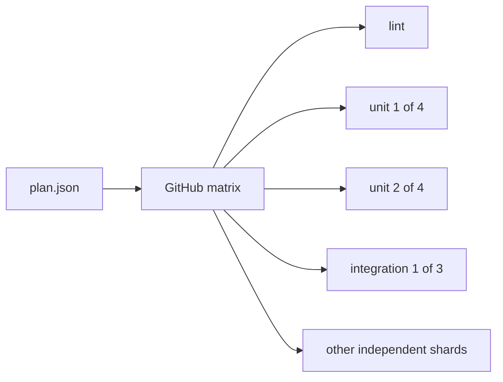

# ci-fleet configuration template

This is the public, secret-free starting point for an organization's private `ci-fleet` configuration repository. It records which trusted projects may use each CI pool, the reviewed desired state for controller machines, infrastructure capacity budgets, logical deployment environments, and the standardized commands every project must expose.

It does **not** contain runner registration tokens, deploy credentials, private keys, host addresses, VM IDs, storage names, backup identifiers, or `.env` files.



## Start a private organization configuration

1. Create a **private** repository from this public template.
2. Clone it and initialize the first project and controller:

   ```bash
   ./scripts/init.sh \
     --organization your-org \
     --project your-app \
     --controller ci-01 \
     --location primary-site \
     --capacity-budget 1 \
     --max-runners 1 \
     --engine-ref <reviewed-ci-fleet-commit>
   ```

3. Edit `fleet.json` to add the organization's real logical mappings.
4. Run the strict policy check:

   ```bash
   ./scripts/validate.sh --strict
   ```

5. Configure secret **values** in GitHub Environments, root-owned host files, or an external secret manager. The repository stores only names such as `DEPLOY_AUTH`.

The initializer refuses to replace a configured file unless `--force` is explicit. Run `./scripts/init.sh --help` for repository, registry, runner-group, controller, location, capacity, resource, and output options.

## Schema v3: Git-authored controller desired state

`fleet.json` is the reviewed authority for logical controller state. Each entry in `controllers` has a unique ID and declares:

- its runner pool and logical location;
- whether it is `active`, `drained`, or `disabled`;
- its unique GitHub scale-set name;
- an `experimental`, `stable`, or `retiring` lifecycle;
- the full reviewed ci-fleet commit SHA it runs;
- minimum and maximum runners;
- CPU and memory available to each ephemeral runner.

The controller ID is how a target host selects its declaration. A location is a non-sensitive logical slug such as `primary-site` or `remote-site`, never an address. Runtime-generated configuration and credentials remain host-local.

### Pool capacity is infrastructure policy

Each runner pool has a `capacity_budget`. The validator totals the maximum capacity of every active or drained controller assigned to the pool and rejects overcommit. Drained capacity remains reserved so an undrain cannot silently exceed the reviewed budget. Disabled controllers do not reserve capacity.

Application repositories do not encode the number of available workers. They submit all independent tasks and shards. Do not use GitHub Actions `strategy.max-parallel` to model fleet size; controllers and the private configuration decide how many jobs run simultaneously. An application may limit concurrency only for a separately documented external-system constraint, not worker availability.

This separation lets one infrastructure change add, remove, drain, or resize controllers without editing every project workflow.

## Target-host installation and adoption

The public ci-fleet engine owns the host installer. Its intended interface consumes one logical controller from a pinned private configuration revision:

```bash
sudo ./scripts/install-worker-controller.sh \
  --config-repo example-org/example-fleet-config \
  --controller example-ci-01 \
  --ref <reviewed-config-commit> \
  --install
```

Use `--adopt` instead of `--install` to bring an existing controller under Git-authored desired state. The engine contract also provides `--check`, `--upgrade`, `--rollback`, and `--uninstall` modes.

The command runs on the target Linux Docker machine. It validates the pinned configuration, renders host-local runtime state, preserves root-owned secrets, drains before disruptive changes, verifies a recoverable checkpoint, installs maintenance services, checks health, and reports drift without exposing credentials. OpenClaw or another agent may invoke it, but no agent is required.

The engine-side implementation is `scripts/install-worker-controller.sh` in the parent ci-fleet repository and remains experimental. This configuration repository never installs a controller by itself.

## Drain, retire, and delete a controller host

Host retirement is an explicit reviewed transition:

1. Change the controller state to `drained` and merge the private configuration change.
2. Converge the host and verify that it accepts no new work and has no active runner.
3. Remove only fleet-owned residue and verify replacement capacity.
4. Unregister its scale set and revoke that host's credentials.
5. Change the declaration to `disabled` or remove it in a later reviewed change.
6. Delete or repurpose the machine according to the installation's declared infrastructure policy.

Deleting one generic controller must not require application workflow changes. Legacy project-specific hosts should remain only until CI, promotion, and deployment no longer reference them.

## Hard rules

- Public repositories never receive direct access to the trusted self-hosted runner pool.
- Every project publishes `scripts/ci/plan.json` and implements `./scripts/ci/run.sh <task> --shard INDEX/TOTAL` in its own Docker-defined test environment.
- `./scripts/ci/run.sh fast` and `full` remain aggregate developer commands; fleet scheduling expands their named tasks across available workers.
- Every matrix job has a five-minute hard timeout, while expected test payload targets four minutes or less to reserve startup and reporting time.
- Application workflows submit all independent jobs; infrastructure configuration alone controls worker capacity.
- CI runner pools and deployment host groups are separate trust roles.
- Production deployment is manual and requires GitHub Environment approval.
- Controller engine revisions, reusable workflows, and third-party actions are pinned to immutable commits.
- Configuration contains logical identifiers only. Secret values, private host details, and credentials never enter Git.
- Promoted artifacts are container image digests; production does not rebuild a different image.

`fleet.schema.json` provides editor completion and structural documentation. `scripts/validate.py` is the authoritative dependency-free policy check, including cross-object relationships JSON Schema cannot express clearly.

## Five-minute parallelism contract

Projects divide their total test-minutes into independent named tasks and deterministic shards. Forty-five test-minutes require at least nine perfectly balanced five-minute jobs in theory. In practice, projects should create additional shards targeting four minutes of test payload so checkout, image preparation, and reporting remain inside the five-minute job ceiling.



Adding workers reduces wall-clock time only while independent shards remain queued. A genuinely indivisible test longer than five minutes must be optimized, split, or moved into an explicitly slower scheduled class outside ordinary CI.

## Repository map

| Path | Purpose |
|---|---|
| `fleet.json` | Fictional, valid schema-v3 configuration with one controller |
| `fleet.schema.json` | JSON Schema draft 2020-12 editor contract |
| `scripts/init.sh` | Safe first-project and first-controller initializer |
| `scripts/validate.sh` | Structural, relational, capacity, and secret-boundary validation |
| `scripts/test_policy.py` | Regression tests proving unsafe configurations fail closed |
| `examples/multi-host/fleet.json` | Fictional two-project, two-location controller topology |
| `SECURITY.md` | Secret handling and vulnerability reporting |
| `AGENTS.md` | Non-negotiable rules for humans and coding agents |

## Public and private boundary

| Safe in this public template | Belongs in the private config repo | Belongs only outside Git |
|---|---|---|
| Schema, validator, fictional examples | Real repository names and runner-group policy | Tokens, passwords, private keys |
| Standard CI entrypoint names | Logical controller IDs and locations | Host addresses, VM IDs, SSH material |
| Controller state and lifecycle vocabulary | Capacity budgets and per-runner limits | Rendered runtime configuration |
| Reusable engine interface | Required secret **names** | Secret values and application credentials |

The public engine and this template use the [Unlicense](LICENSE). See [THIRD_PARTY_NOTICES.md](THIRD_PARTY_NOTICES.md) before copying third-party material into a derived repository.
